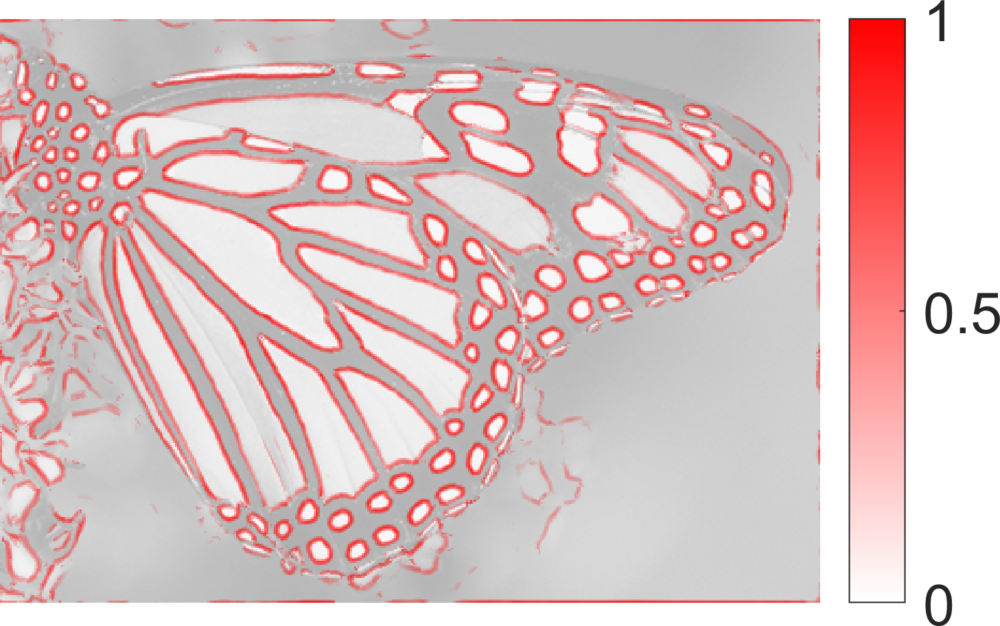
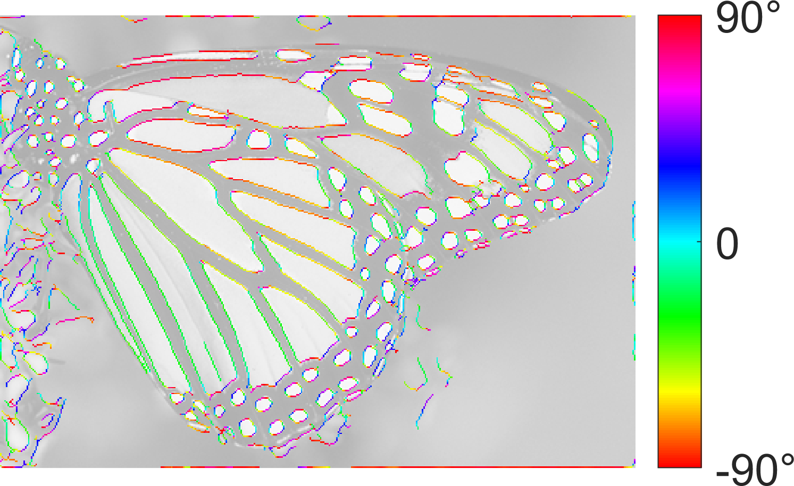
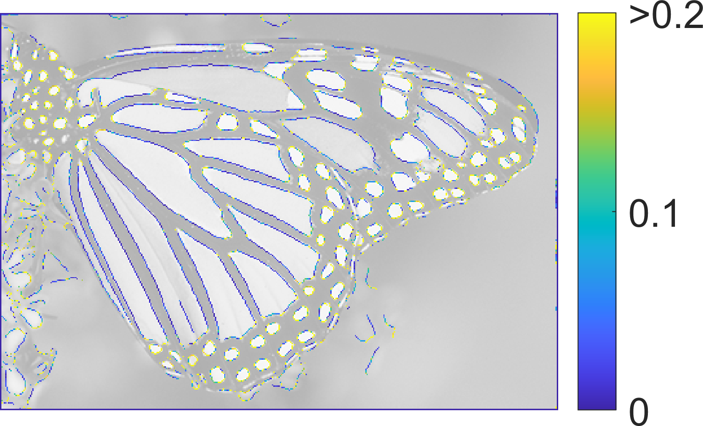
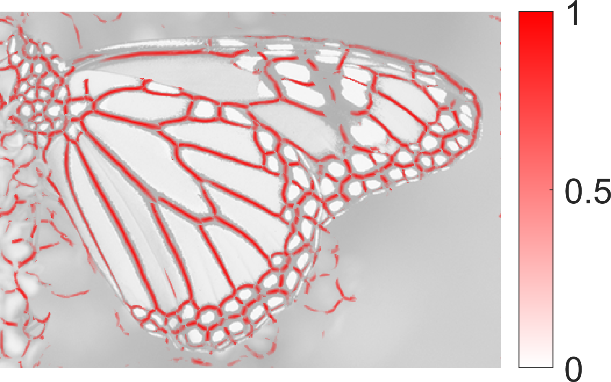
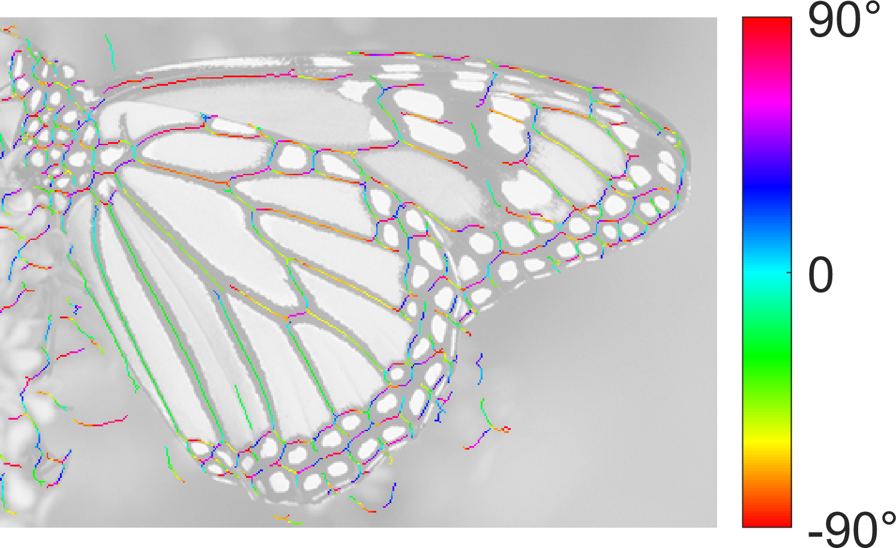
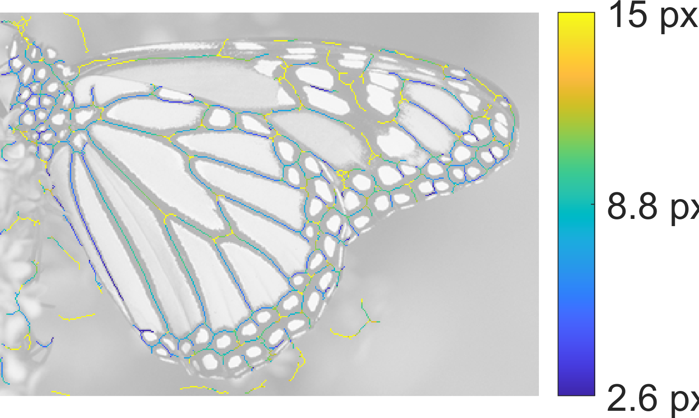
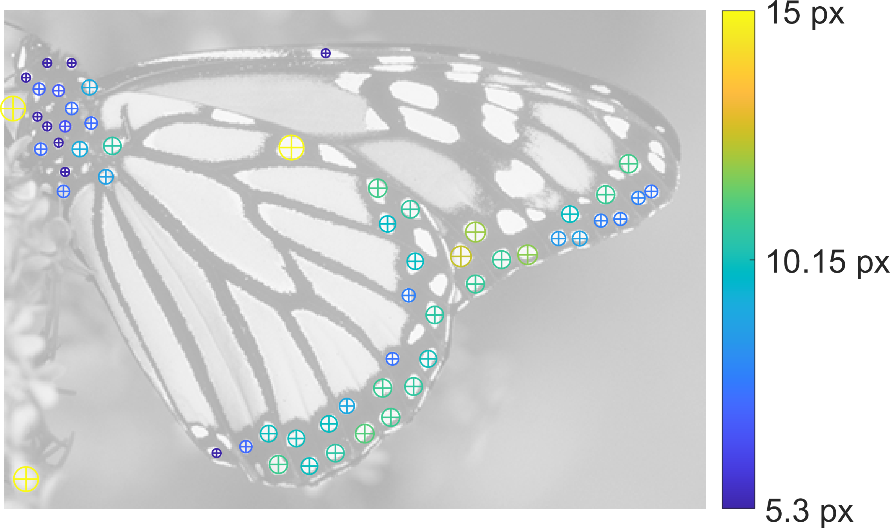

# SymFD

Symmetric Molecule-Based Feature Detector (SymFD) v 1.1

Written by Rafael Reisenhofer (University of Vienna), 2018
Published under the MIT license

If you use this toolbox in your research, please cite the following paper:

- R. Reisenhofer, E. J. King, "Edge, Ridge, and Blob Detection with Symmetric Molecules"

## How to get started

1. Add all folders and subfolders to your MATLAB path
2. Try to run SFDcompileMexFiles to make sure that all necessary .mex-files exist
3. Run SFDGUI to open the GUI or run any of the examples in the folder 'Examples'

Contact: reisenhofer@uni-bremen.de

## Requirements 

SFDexportMap requires the export_fig toolbox written by Yair Altman. The toolbox can 
be obtained from mathworks at https://de.mathworks.com/matlabcentral/fileexchange/23629-export_fig

## Acknowledgements 

The files K05_CH_full.png, K05_OH_full.png, A0.png, B0.png,
and A02_test.avi were kindly provided by Johannes Kiefer.

The files churchandcapitol.bmp, dancers.bmp, monarch.bmp,
and studentsculpture.bmp, are part of the LIVE image quality
assessment databse:

H. R. Sheikh, Z. Wang, L. Cormack and A. C. Bovik, "LIVE Image Quality 
Assessment Database Release 2", http://live.ece.utexas.edu/research/quality.

The file i19.bmp is part of the Tampere Image Database (TID) 2008:

N. Ponomarenko, V. Lukin, A. Zelensky, K. Egiazarian, M. Carli, F. Battisti,
"TID2008 - A Database for Evaluation of Full-Reference Visual Quality Assessment Metrics",
Advances of Modern Radioelectronics, Vol. 10, pp. 30-45, 2009.

## Examples

Example scripts are included in the `examples` folder within the repository.

### Input

### Edge Detection - Raw Edge Measure

### Edge Detection - Tangent Directions

### Edge Detection - Curvature

### Ridge Detection - Raw Ridge Measure

### Ridge Detection - Tangent Directions

### Ridge Detection - Widths

### Blob Detection

